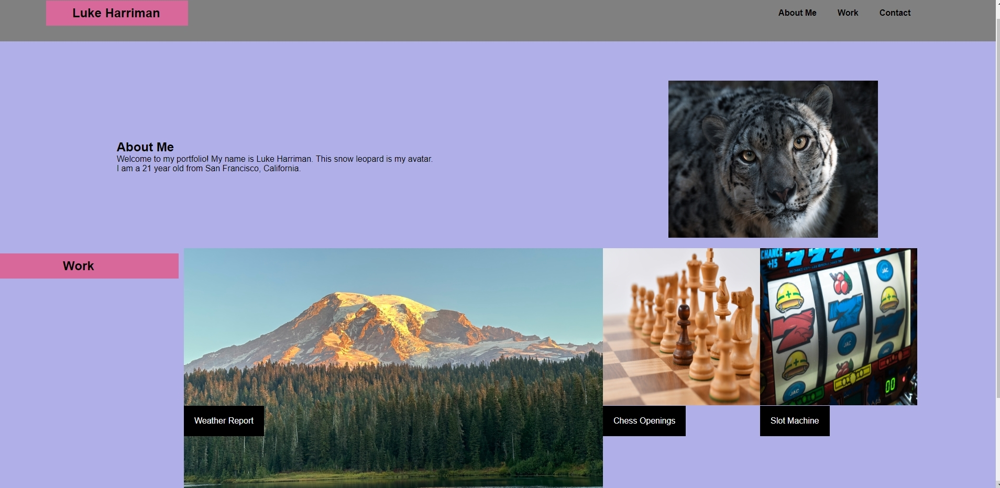

# module-2-challenge 

## Technology Used 

| Technology Used         | Resource URL           | 
| ------------- |:-------------:| 
| HTML    | [https://developer.mozilla.org/en-US/docs/Web/HTML](https://developer.mozilla.org/en-US/docs/Web/HTML) | 
| CSS     | [https://developer.mozilla.org/en-US/docs/Web/CSS](https://developer.mozilla.org/en-US/docs/Web/CSS)      |   
| Git | [https://git-scm.com/](https://git-scm.com/)     |    

## Description 

[Visit the Deployed Site](https://lth1013.github.io/module-2-challenge/)

This website is my portfolio. It gives my contact information, shows some of my applications, and gives a short description of who I am.

## Usage 
To use my website, open it using the link provided. Then use the nav bar to navigate the website, and click on the images if you want to view the placeholder applications.

## Learning Points 

I learned a lot from this application. I was able to practice my skills with CSS, Git, and HTML. Specifically, I was able to practice creating a website that had a nav bar with links, a responsive environment, inserting images with text over them, and using flex. My learning foundation was greatly increased by this project.

## Author Info

### Luke Harriman

* [Portfolio](https://lth1013.github.io/module-2-challenge/)
* [LinkedIn](https://www.linkedin.com/in/luke-harriman-12901a280/)
* [Github](https://github.com/lth1013)